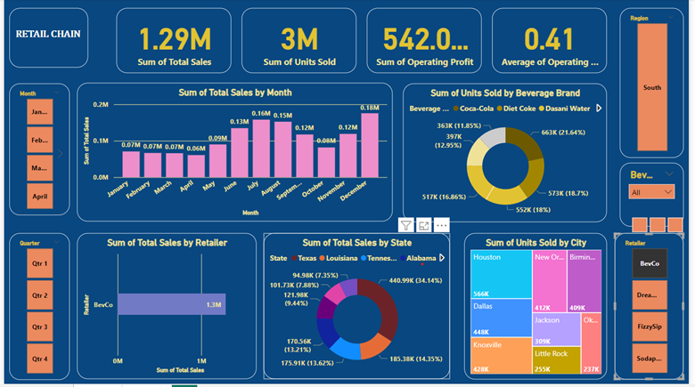

# Financial Analytics Dashboard

## Problem
Businesses lack visibility into revenue trends and customer behavior, leading to poor decision-making.

## Objective
To build a dashboard that tracks KPIs, identifies revenue trends, and detects anomalies.

## Tools Used
- SQL
- Power BI

## Key Insights
- Top 10% of customers contribute a disproportionate share of total revenue, indicating high customer concentration risk
- Revenue trends show fluctuations across time periods, suggesting potential seasonality or inconsistent performance
- High-value transactions identified as anomalies, which may require further investigation for risk or fraud

## Recommendations
- Focus on retaining high-value customers to stabilize revenue streams
- Investigate causes of revenue fluctuations and implement strategies for consistent growth
- Monitor anomalous transactions regularly to mitigate potential financial risks  

## Project Workflow
1. Data cleaning and preparation using SQL
2. Data analysis to identify trends and anomalies
3. Dashboard development in Power BI
4. Insight generation and business recommendations

## Dashboard Preview

## Business Impact
This dashboard enables stakeholders to:
- Monitor financial performance in real time
- Identify revenue concentration risks
- Detect unusual transaction patterns for further investigation
